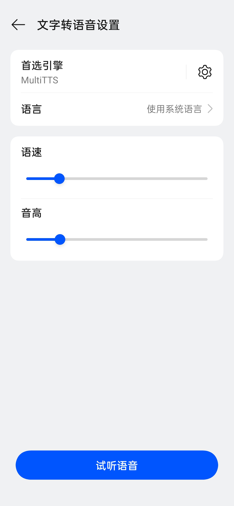
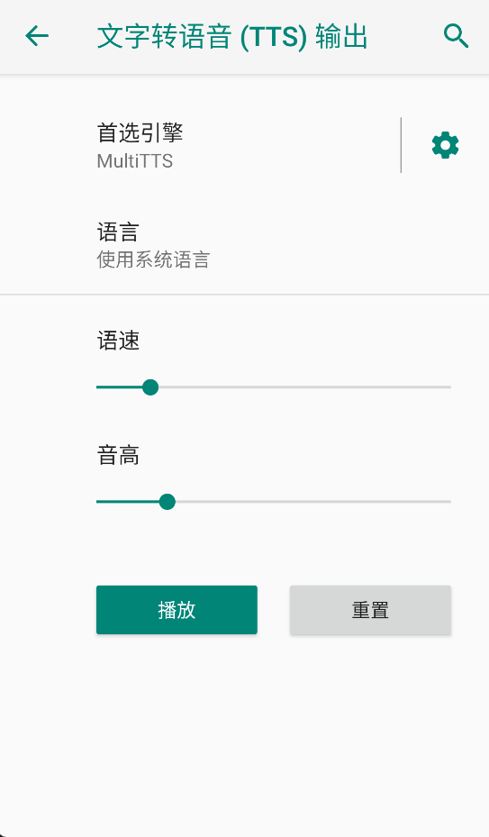

# 语道 (VoiceDAO)

## 项目简介

语道 (VoiceDAO) 是一个极简的 Android 文本转语音（TTS）演示应用。用户可输入文本，调节语速和音调，一键朗读。该项目依赖于系统当前设置的 TTS 引擎，本身不内置语音合成能力。

## 主要功能

- 输入任意文本并朗读
- 支持语速、音调调节
- 简洁直观的界面
- 状态提示与用户说明

## 与 TTS 引擎的区别

| 软件/项目              | 类型       | 是否TTS引擎 | 是否可切换语言 | 作用对象      | 备注                       |
| ------------------ | -------- | ------- | ------- | --------- | ------------------------ |
| MultiTTS           | 第三方TTS引擎 | 是       | 是       | 全系统/所有App | 云端/多主播/多语言，安装后可设为系统TTS引擎 |
| TTS-Server-Android | 第三方TTS引擎 | 是       | 是       | 全系统/所有App | 可自定义后端，安装后可设为系统TTS引擎     |
| 语道 (VoiceDAO)（本项目） | 普通App    | 否       | 否       | 仅本App     | 依赖系统TTS设置                |

## 系统 TTS 设置页面说明

Android 系统的“文字转语音（TTS）设置”页面用于选择和配置系统TTS引擎、朗读语言、语速、音高，并可试听当前设置下的发音效果。所有App的朗读效果都受这里的设置影响。

### 如何进入“文字转语音（TTS）设置”页面

1. 打开手机“设置”应用。
2. 搜索“文字转语音”或依次进入“系统” > “语言和输入法” > “文字转语音输出”。
3. 即可进入TTS设置页面，进行相关配置。

### 主要功能

- **首选引擎**：选择当前系统使用的TTS引擎（如 MultiTTS、TTS Server 等）。
- **语言**：设置TTS朗读时使用的语言（如中文、英文、日语等）。
- **语速/音高**：调节TTS朗读的语速和音调。
- **试听语音**：可试听当前设置下的TTS发音效果。

**注意：**

- 此页面设置的“语言、语速、音高”主要在“试听语音”时生效。大多数App（包括本项目）会在调用TTS朗读时自行指定参数，优先级高于系统设置页面。
- 如果TTS引擎本身不支持某种语言，即使在此页面设置也不会生效，App朗读时同理。

**示例截图：**

## 语速与音调设置说明

### 1. App内语速和音调的实现

- 本项目通过 Android TextToSpeech API 的 setSpeechRate(float rate) 和 setPitch(float pitch) 方法实现语速和音调调节。
- 语速（Speech Rate）：setSpeechRate(speechRate)，1.0为正常语速，<1.0为慢速，>1.0为快速。
- 音调（Pitch）：setPitch(pitch)，1.0为正常音调，<1.0为低音，>1.0为高音。
- 这两个参数由界面滑块等控件获取用户输入后赋值，在朗读或合成音频前设置。

### 2. 与TTS引擎全局设置的关系

- App内设置的语速和音调只影响本App当前TTS实例，不会影响系统全局或其他App。
- TTS引擎（如讯飞、Google等）在系统TTS设置界面也可设置默认语速/音调，这些是全局默认值。
- 优先级：App内通过API设置的语速/音调优先级更高，会覆盖TTS引擎的全局默认设置。
- 不会冲突：只要App内设置了语速/音调，TTS引擎会以App传递的参数为准，不会和系统设置冲突。
- 如果App未设置语速/音调，则TTS引擎会采用系统设置的默认值。

**推荐做法**：建议通过App内控件让用户自定义语速/音调，并在每次朗读/合成前用API设置，体验最可控。

## 开发指南

- [Toast 开发指南](./docs/Toast开发指南.md) - Toast 消息提示的使用规范和最佳实践

## 许可证

MIT